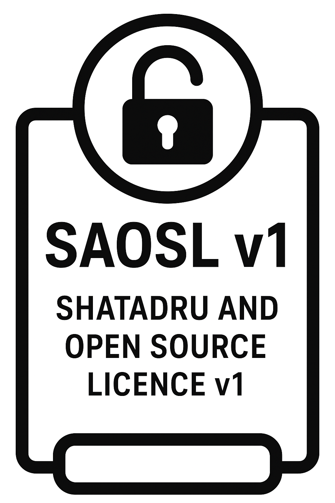
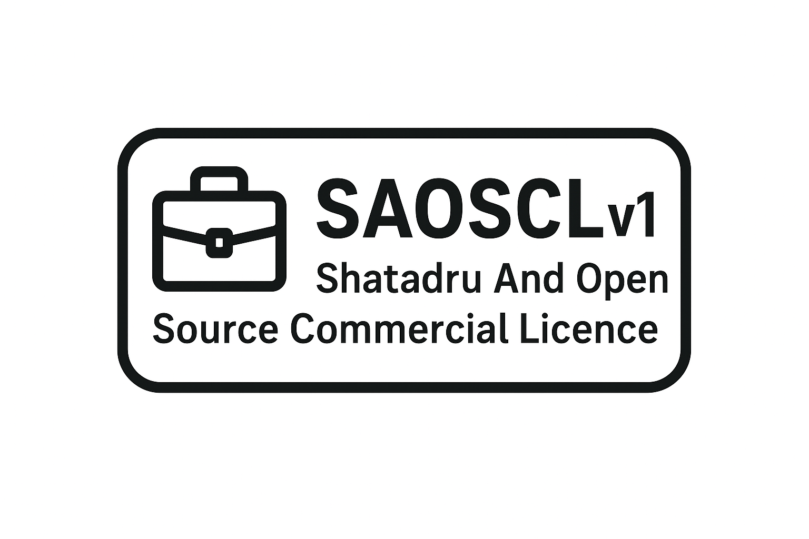

# 📜 Shatadru And Open Source Licences

Welcome to the official repository of the **Shatadru And Open Source Licence v1 (SAOSL v1)** and the **Shatadru And Open Source Commercial Licence v1 (SAOSCL v1)**.  

These licenses are designed to balance **open source freedom** with **commercial protection**, ensuring that individuals, students, and businesses can use digital works fairly and responsibly.  

---

## ⚡ Licences Overview

### ✅ Shatadru And Open Source Licence v1 (SAOSL v1)
- Free, open-source license.  
- Allows **use, study, modification, and sharing**.  
- **Non-commercial use only.**  
- Requires **attribution** to Shatadru.  
- Includes **limited warranty**.  
- Governed by **EU law**.  

📂 Files:  
- [`SAOSL_v1.txt`](./SAOSL_v1.txt) – Full legal text  
- [`SAOSL_v1_SUMMARY.md`](./SAOSL_v1_SUMMARY.md) – Human-readable summary  
-   

---

### 💼 Shatadru And Open Source Commercial Licence v1 (SAOSCL v1)
- Grants **commercial rights** (use in business, resale, services).  
- Requires **paid license**.  
- Allows **derivatives and bundling** with attribution.  
- Provides **limited warranty & support**.  
- Governed by **EU law**.  

📂 Files:  
- [`SAOSCL_v1.txt`](./SAOSCL_v1.txt) – Full legal text  
- [`SAOSCL_v1_SUMMARY.md`](./SAOSCL_v1_SUMMARY.md) – Human-readable summary  
-   

---

## 📝 Attribution
When using either license, attribution must include:

Licensed under Shatadru And Open Source Licence v1 (SAOSL v1)
or
Licensed under Shatadru And Open Source Commercial Licence v1 (SAOSCL v1)
by Shatadru Bose.

---

## 💰 Commercial Licensing
If you wish to use the Licensed Work commercially, you **must obtain a commercial license (SAOSCL v1)**.  

👉 Contact **Shatadru Bose** for commercial licensing options, or visit the official purchase link (coming soon).  

---

## 📌 Quick Comparison

| Feature                        | SAOSL v1 (Free)       | SAOSCL v1 (Commercial) |
|--------------------------------|-----------------------|-------------------------|
| Personal/Educational Use       | ✅ Allowed            | ✅ Allowed              |
| Modification & Sharing         | ✅ With credit        | ✅ With credit          |
| Commercial Use                 | ❌ Not allowed        | ✅ With license         |
| Warranty                       | ✅ Limited warranty   | ✅ Extended warranty    |
| Jurisdiction                   | EU Law               | EU Law                  |
| Attribution Required           | ✅ Yes               | ✅ Yes                 |

---

## 🚀 About
Created and maintained by **Shatadru Bose**.  
Version: **v1.0 (2025)**  
